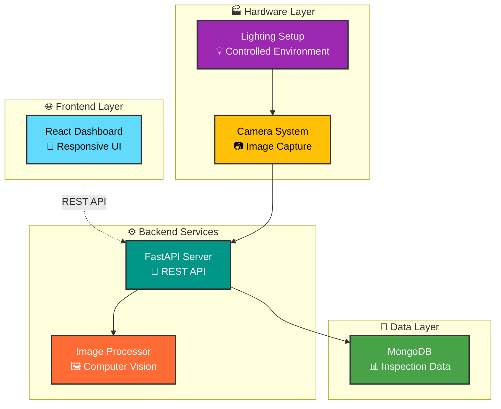
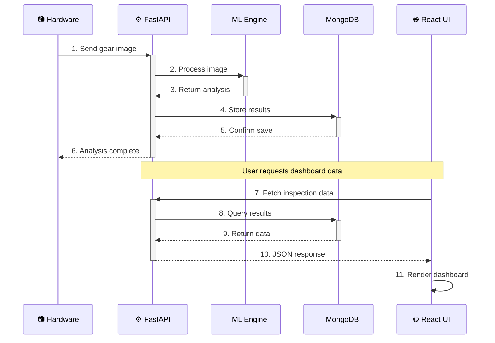
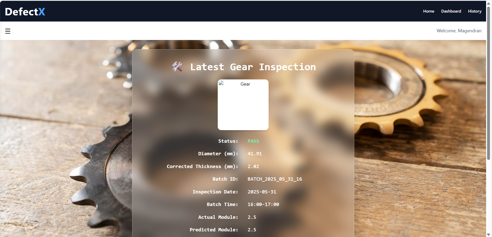
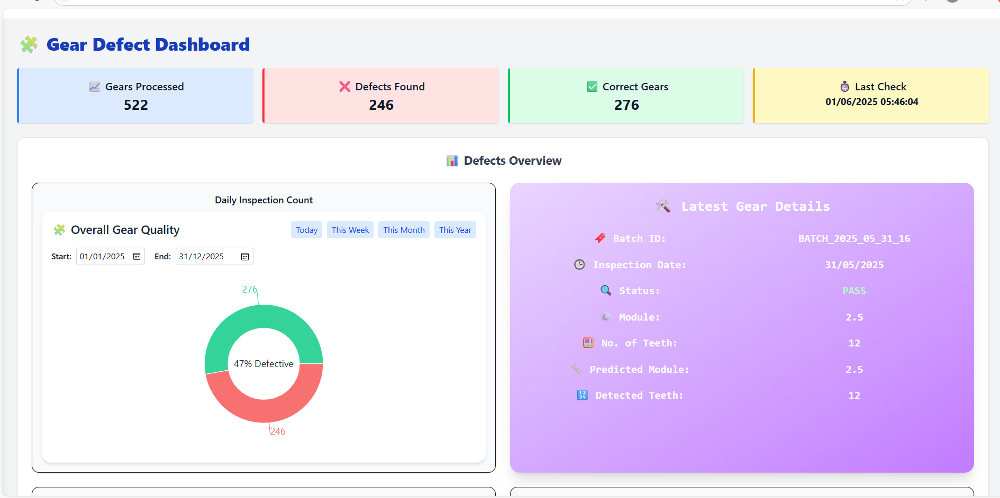
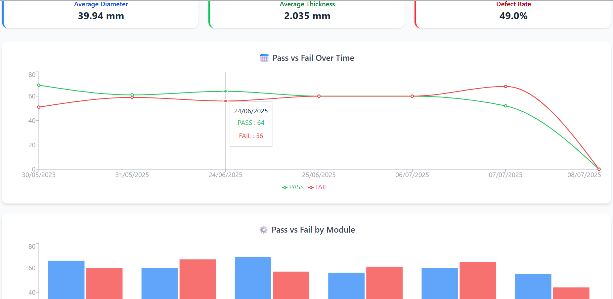

# AVIS: Automated Visual Inspection System for Spur Gears

<div align="center">


**🔍 A full-stack dashboard for real-time defect detection and quality control in spur gear manufacturing**

[](https://choosealicense.com/licenses/mit/)
[](https://react.dev/)
[](https://fastapi.tiangolo.com/)
[](https://mongodb.com/)
[](https://vitejs.dev/)
[](https://tailwindcss.com/)

[🚀 Live Demo](https://spur-gear-frontend.onrender.com/analysis) • [📖 Documentation](README.md) • [🐛 Report Bug](https://github.com/Magendran10/spur-gear-frontend/issues) • [✨ Request Feature](https://github.com/Magendran10/spur-gear-frontend/issues)

</div>

---

## 🎯 Overview

AVIS revolutionizes traditional spur gear inspection by replacing time-consuming manual processes with an intelligent, automated visual inspection system. Built with modern web technologies, it provides real-time defect detection, dimensional analysis, and comprehensive quality control through an intuitive dashboard interface.

### 🌟 Why AVIS?

- **⚡ Lightning Fast**: Real-time processing and instant results
- **🎯 Precision Focused**: Advanced computer vision for accurate defect detection
- **📊 Data-Driven**: Comprehensive analytics and historical tracking
- **🌐 Web-Based**: Access from anywhere with a modern browser
- **🔧 Production Ready**: Built for industrial manufacturing environments

---

## ✨ Key Features

<table>
<tr>
<td width="50%">

### 🔍 **Intelligent Detection**
- Real-time defect identification
- Dimensional accuracy verification
- Surface quality analysis
- Automated pass/fail classification

### 📊 **Interactive Dashboard**
- Live inspection results
- Historical data visualization
- Quality metrics tracking
- Customizable reporting

</td>
<td width="50%">

### ⚡ **High Performance**
- Sub-second processing times
- Concurrent inspection handling
- Optimized image analysis
- Responsive web interface

### 🛠️ **Easy Integration**
- RESTful API architecture
- Modular component design
- Scalable infrastructure
- Comprehensive documentation

</td>
</tr>
</table>

---

## 🏗️ System Architecture



### 🔄 Data Flow Pipeline



---

## 🛠️ Tech Stack

<div align="center">

| Layer | Technologies |
|:-----:|:------------|
| **Frontend** |    |
| **Backend** |   |
| **Database** |  |
| **DevOps** |   |

</div>

---

## 🚀 Quick Start

### Prerequisites

> **Note**: Ensure you have the following installed on your development machine

- **Node.js** >= 18.0.0
- **npm** >= 8.0.0
- **Python** >= 3.8
- **MongoDB** >= 5.0

### 🔧 Installation

1. **Clone the repository**
   ```bash
   git clone https://github.com/yourusername/avis.git
   cd avis
   ```

2. **Install frontend dependencies**
   ```bash
   npm install
   ```

3. **Environment setup**
   ```bash
   # Create environment file
   cp .env.example .env
   
   # Edit with your configuration
   nano .env
   ```

4. **Configure environment variables**
   ```env
   # Frontend Configuration
   VITE_API_BASE_URL=http://127.0.0.1:8000
   VITE_APP_TITLE=AVIS Dashboard
   VITE_REFRESH_INTERVAL=5000
   
   # Backend Configuration (if running locally)
   MONGODB_URL=mongodb://localhost:27017/avis
   API_HOST=0.0.0.0
   API_PORT=8000
   ```

5. **Start the development server**
   ```bash
   npm run dev
   ```

6. **Access the application**
   ```
   🌐 Frontend: http://localhost:5173
   ⚙️ Backend API: http://localhost:8000
   📚 API Docs: http://localhost:8000/docs
   ```

---

## 📁 Project Structure

```
avis/
├── 📁 public/                 # Static assets
│   ├── favicon.ico           # Application favicon
│   └── logo.svg              # Brand logo
├── 📁 src/                   # Source code
│   ├── 📁 components/        # Reusable React components
│   │   ├── Dashboard/        # Dashboard-specific components
│   │   ├── Charts/          # Data visualization components
│   │   └── UI/              # Generic UI components
│   ├── 📁 pages/            # Page components
│   │   ├── Home.jsx         # Main dashboard page
│   │   ├── Analytics.jsx    # Analytics page
│   │   └── Settings.jsx     # Configuration page
│   ├── 📁 hooks/            # Custom React hooks
│   ├── 📁 utils/            # Utility functions
│   ├── 📁 assets/           # Images, fonts, icons
│   ├── App.jsx              # Main application component
│   └── main.jsx             # Application entry point
├── 📄 .env.example          # Environment variables template
├── 📄 index.html            # HTML template
├── 📄 vite.config.js        # Vite configuration
├── 📄 tailwind.config.js    # Tailwind CSS configuration
├── 📄 package.json          # Dependencies and scripts
└── 📄 README.md             # This file
```

---

## 📊 API Documentation

### Core Endpoints

| Method | Endpoint | Description | Response |
|:------:|:---------|:------------|:---------|
| `GET` | `/api/v1/inspections` | Retrieve all inspections | `200 OK` |
| `POST` | `/api/v1/inspect` | Submit new gear for inspection | `201 Created` |
| `GET` | `/api/v1/analytics` | Get quality analytics | `200 OK` |
| `GET` | `/api/v1/health` | System health check | `200 OK` |

### Example API Response

```json
{
  "inspection_id": "64a7b8f9e1234567890abcde",
  "timestamp": "2024-01-15T10:30:00Z",
  "gear_id": "GEAR_001",
  "status": "PASS",
  "defects": [],
  "dimensions": {
    "outer_diameter": 50.2,
    "inner_diameter": 10.1,
    "thickness": 5.0
  },
  "confidence_score": 0.98
}
```

---
## 🎨 Screenshots

<div align="center">

### 🏠 Main Dashboard


### 📊 Analytics View


### 🔍 Inspection Details


</div>

---

## 🧪 Testing

```bash
# Run all tests
npm run test

# Run tests with coverage
npm run test:coverage

# Run end-to-end tests
npm run test:e2e

# Lint code
npm run lint

# Format code
npm run format
```

---

## 🚀 Deployment

### Docker Deployment

```bash
# Build and run with Docker Compose
docker-compose up -d

# Or build individually
docker build -t avis-frontend .
docker run -p 3000:3000 avis-frontend
```

### Production Build

```bash
# Create optimized build
npm run build

# Preview production build
npm run preview
```

---

## 🤝 Contributing

We welcome contributions! Please see our [Contributing Guidelines](CONTRIBUTING.md) for details.

### Development Workflow

1. **Fork** the repository
2. **Create** a feature branch (`git checkout -b feature/amazing-feature`)
3. **Commit** your changes (`git commit -m 'Add amazing feature'`)
4. **Push** to the branch (`git push origin feature/amazing-feature`)
5. **Open** a Pull Request

### Code Style

- Follow [ESLint](https://eslint.org/) rules
- Use [Prettier](https://prettier.io/) for formatting
- Write meaningful commit messages
- Add tests for new features

---

## 📈 Roadmap

- [x] **Phase 1**: Core inspection system
- [x] **Phase 2**: Web dashboard implementation
- [ ] **Phase 3**: Machine learning integration
- [ ] **Phase 4**: Advanced analytics
- [ ] **Phase 5**: Mobile application
- [ ] **Phase 6**: Multi-camera support

---

## 📄 License

This project is licensed under the MIT License - see the [LICENSE](LICENSE) file for details.

---

## 🆘 Support

<div align="center">

**Need help?** We're here for you!

[](https://your-docs-url.com)
[](https://discord.gg/your-server)
[](mailto:support@yourproject.com)

</div>

---

## 🙏 Acknowledgments

- **Computer Vision Community** for inspiring ML approaches
- **React Team** for the amazing framework
- **FastAPI** for the excellent Python framework
- **Open Source Contributors** for making this possible

---

<div align="center">

**⭐ Star this repository if you find it helpful!**

[](https://github.com/yourusername/avis/stargazers)
[](https://github.com/yourusername/avis/network)
[](https://github.com/yourusername/avis/watchers)

Made with ❤️ for the manufacturing industry

</div>
